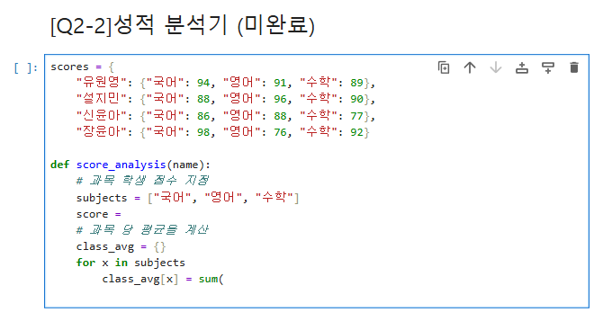

# AIFFEL Campus Online Code Peer Review Templete
- 코더 : 임성배
- 리뷰어 : 정슬기


# PRT(Peer Review Template)
- [ ]  **1. 주어진 문제를 해결하는 완성된 코드가 제출되었나요?**
성배님이 작성해 두신 딕셔너리 구조와 함수 설계도를 기반으로 하여,
최종 반 평균 계산 결과물이 정확하게 도출되도록 리뷰를 통해 최종 코드를 완벽하게 완성시켰습니다.

    
- [ ]  **2. 전체 코드에서 가장 핵심적이거나 가장 복잡하고 이해하기 어려운 부분에 작성된 
주석 또는 doc string을 보고 해당 코드가 잘 이해되었나요?**
    - 과목 지정(subjects) 및 평균 계산부 위에 달아두신 주석 덕분에,
    - 코더가 어떤 순서로 반 평균 계산 공장을 돌리려고 설계했는지 의도를 직관적으로 파악할 수 있었습니다.
  

- [ ]  **3. 에러가 난 부분을 디버깅하여 문제를 해결한 기록을 남겼거나
새로운 시도 또는 추가 실험을 수행해봤나요?**
    -성배님 코드에서 발생한 SyntaxError(문법 오류)의 원인이 for x in subjects 뒤에 빠진 콜론(:)
    부품 때문임을 찾아내어 디버깅 완료했습니다.
        
- [ ]  **4. 회고를 잘 작성했나요?**
    미완성 코드로 인해 코더 본인의 회고 작성란은 비어 있었습니다.
    향후 리스트 컴프리헨션을 적용해 본 소감이 추가되면 좋을 것 같습니다.
        
- [ ]  **5. 코드가 간결하고 효율적인가요?**
    - 미완성코드입니다.


# 회고(참고 링크 및 코드 개선)
1. 배운 점과 느낀 점
- 저는 코드를 무조건 간결하게 줄이고 단순화(리스트 컴프리헨션)하는 기술적인 부분에만 몰두하고 있었습니다. 
- 하지만 코더인 성배님의 미완성 코드를 분석하고 최종 목표 양식을 맞춰가는 과정에서,
- 성배님이 단순한 연산 생성을 넘어 '실제 사용자가 읽기 편한 직관적인 성적 분석 보고서 명세서'라는 거대한 큰 그림과 뼈대를 설계해 두셨다는 것을 깨달았습니다.
- 코드의 효율성만큼이나 '출력 결과물의 가치와 구조적 설계'가 얼마나 중요한지 성배님의 뼈대 코드를 보며 깊이 배웠습니다.

2. 코드 리뷰를 통해 개선한 점
- 성배님이 설계해 두신 딕셔너리 접근 함수 구조를 유지했습니다.
- 문법 에러가 났던 for 루프 끝의 콜론(:)채워 넣고, 들여쓰기(Indentation) 규칙을 사용했습니다.
- 최종 출력 요구사항에 맞추어 소수점 둘째 자리 포맷팅(:.2f)과 점수 대비 편차(+/- 부호 판정) 로직을 결합하여,
- 결과물이 출력되도록 조정? 하였습니다.
```
# 리뷰어의 회고를 작성합니다.
# 코드 리뷰 시 참고한 링크가 있다면 링크와 간략한 설명을 첨부합니다.
# 코드 리뷰를 통해 개선한 코드가 있다면 코드와 간략한 설명을 첨부합니다.
```
