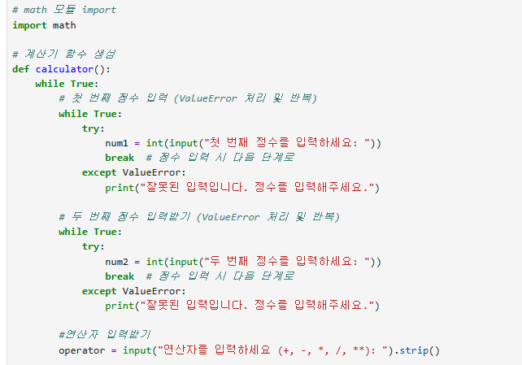
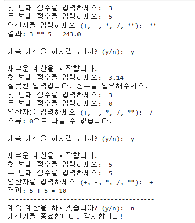
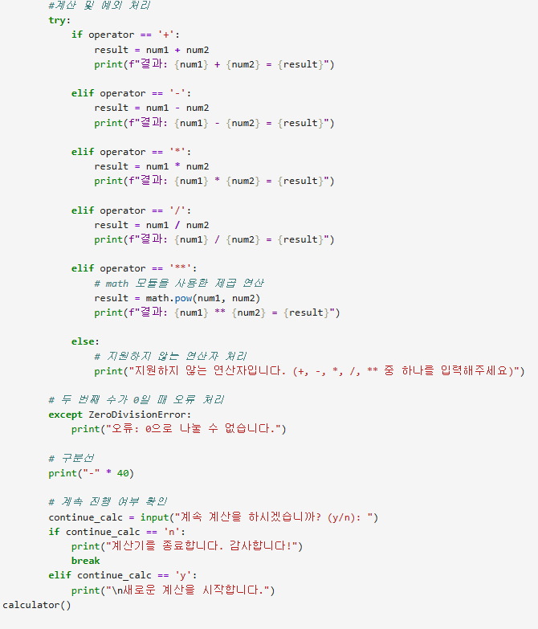

# AIFFEL Campus Online Code Peer Review Templete
- 코더 : 임성배
- 리뷰어 : 조연우

# PRT(Peer Review Template)
- [x]  **1. 주어진 문제를 해결하는 완성된 코드가 제출되었나요?**

[주어진 문제를 해결하는 코드]

  

[최종결과물 사진]

- [x]  **2. 전체 코드에서 가장 핵심적이거나 가장 복잡하고 이해하기 어려운 부분에 작성된 
주석 또는 doc string을 보고 해당 코드가 잘 이해되었나요?**

:계산을 하는 과정에서 정수가 아닌 것을 입력했을때 에러가 나는 코드를 만들어서 계산기 프로그램이 멈춤 없이 작동 할 수있게 만들어준 코드임을 알 수 있었다.
- [ ]  **3. 에러가 난 부분을 디버깅하여 문제를 해결한 기록을 남겼거나
새로운 시도 또는 추가 실험을 수행해봤나요?**
  
  :없음
        
- [ ]  **4. 회고를 잘 작성했나요?**
  
  :없음
        
- [x]  **5. 코드가 간결하고 효율적인가요?**
  
  :프로그램에 실해에 필요한 고드만 활용하여 간결하게 만들었다.

# 회고(참고 링크 및 코드 개선)

:임성배님의 코드를 보고 계산기 프로그램을 짜는 형태를 알아볼 수있었다. 내가 짠 코드와 다른점은
정수를 입력하는 과정에서 result를 활용해서 정수를 기억하게 만들어 정수가 아닌 것을 입력 했을때 처음부터 다시 정수를 입력하지 않아도 되는 편리함이 있었다
