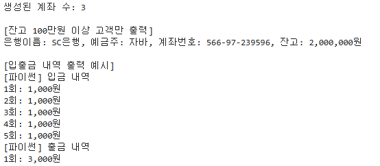
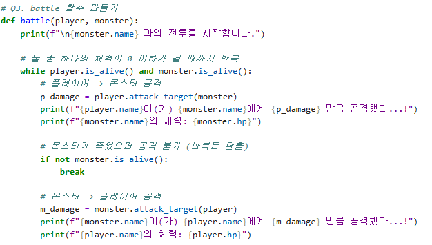
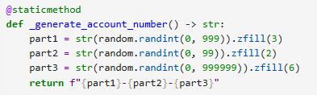
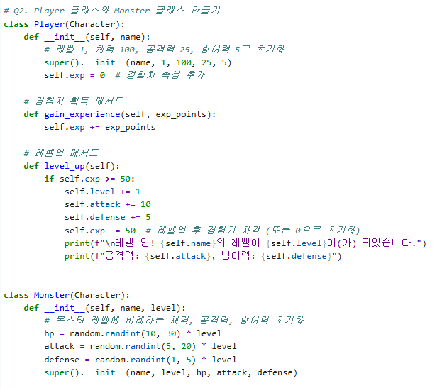

# AIFFEL Campus Online Code Peer Review Templete
- 코더 : 임성배
- 리뷰어 : 정슬기


# PRT(Peer Review Template)
- [X]  **1. 주어진 문제를 해결하는 완성된 코드가 제출되었나요?**
    - Account 클래스와 Character 상속 기반의 RPG 게임 로직이 요구사항대로 모두 구현되었습니다.
        - 
    
- [X]  **2. 전체 코드에서 가장 핵심적이거나 가장 복잡하고 이해하기 어려운 부분에 작성된 
주석 또는 doc string을 보고 해당 코드가 잘 이해되었나요?**
    - battle 함수 내에 각 상황별 주석이 잘 달려 있어 전투의 흐름이 명확히 이해됩니다.
        - 
        
- [X]  **3. 에러가 난 부분을 디버깅하여 문제를 해결한 기록을 남겼거나
새로운 시도 또는 추가 실험을 수행해봤나요?**
    - _generate_account_number에서 .zfill()을 사용하여 계좌번호의 자릿수를 일정하게 맞춘 점이 눈에 보입니다.
      데이터 형식 유지라는 측면에서 매우 좋은것 같아요.
        - 
        
- [X]  **4. 회고를 잘 작성했나요?**
    -회고작성이 되어있지 않습니다.
        
- [X]  **5. 코드가 간결하고 효율적인가요?**
    - 파이썬 스타일 가이드 (PEP8) 를 준수하였는지 확인
    - 코드 중복을 최소화하고 범용적으로 사용할 수 있도록 함수화/모듈화했는지 확인
        - 


# 회고(참고 링크 및 코드 개선)
```
성배님 코드를 보니 정말 깔끔한것 같습니다 !
특히 Character 클래스를 만들고 Player랑 Monster가 그걸 상속받아서 쓰게 만든 구조가 인상 깊었어요. 
덕분에 중복 코드도 확 줄고, 코드가 전체적으로 정돈된 느낌을 받았습니다. 
battle 함수에서 while 문으로 전투 주고받는 로직도 짤 때 고민을 많이 하신 게 느껴져서 저도 배우는 점이 많았습니다. 
좋은 코드 보여주셔서 감사합니다!
