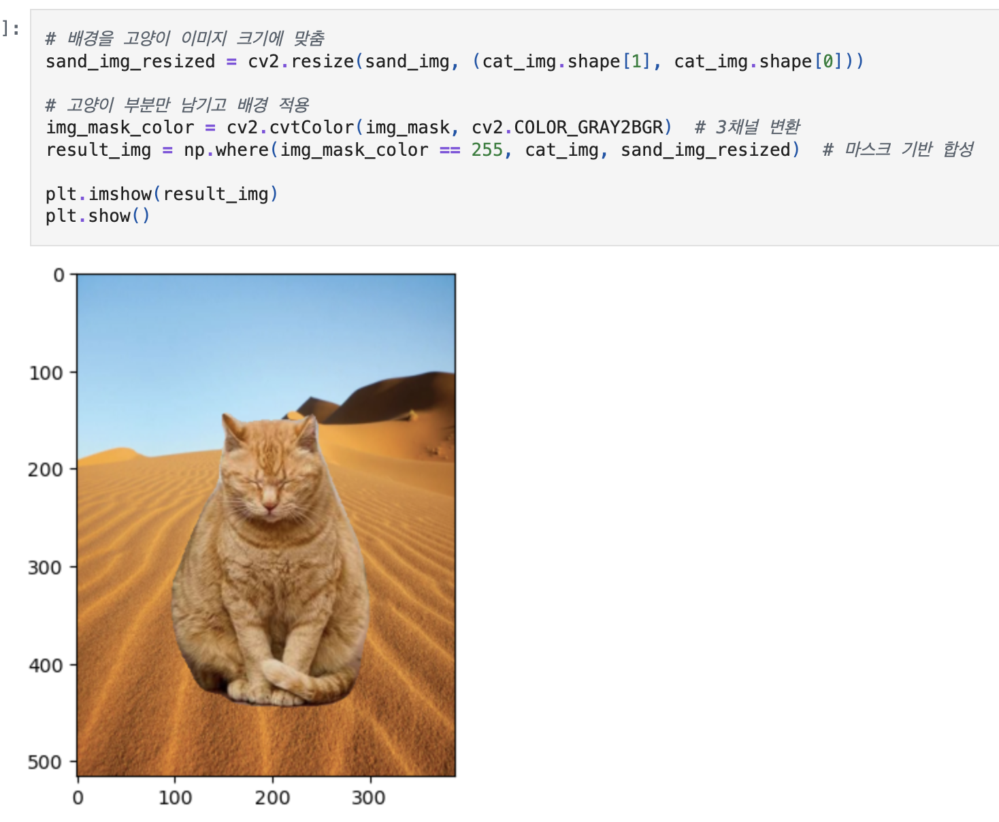
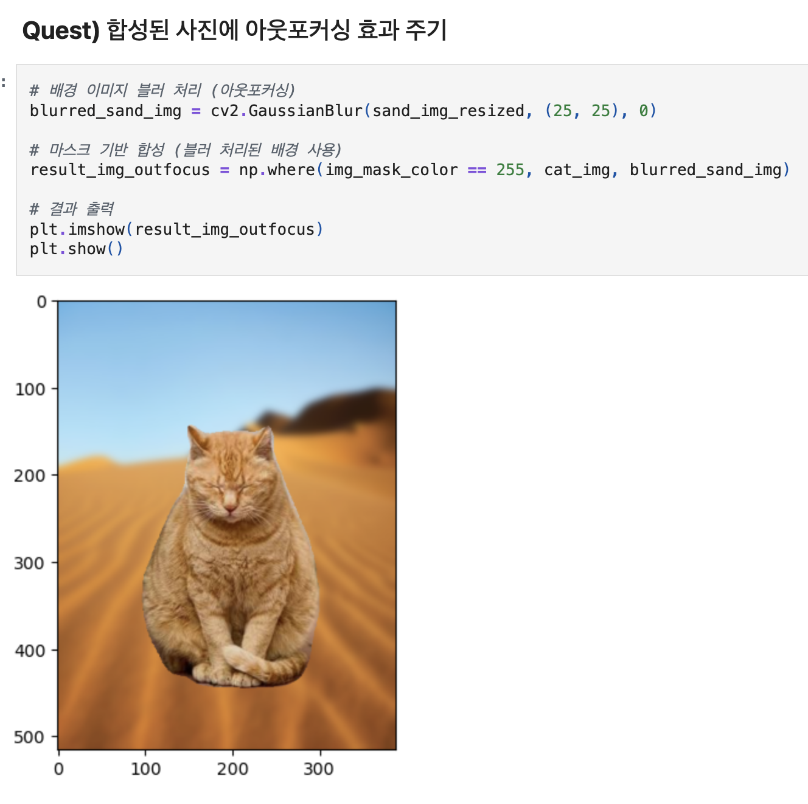
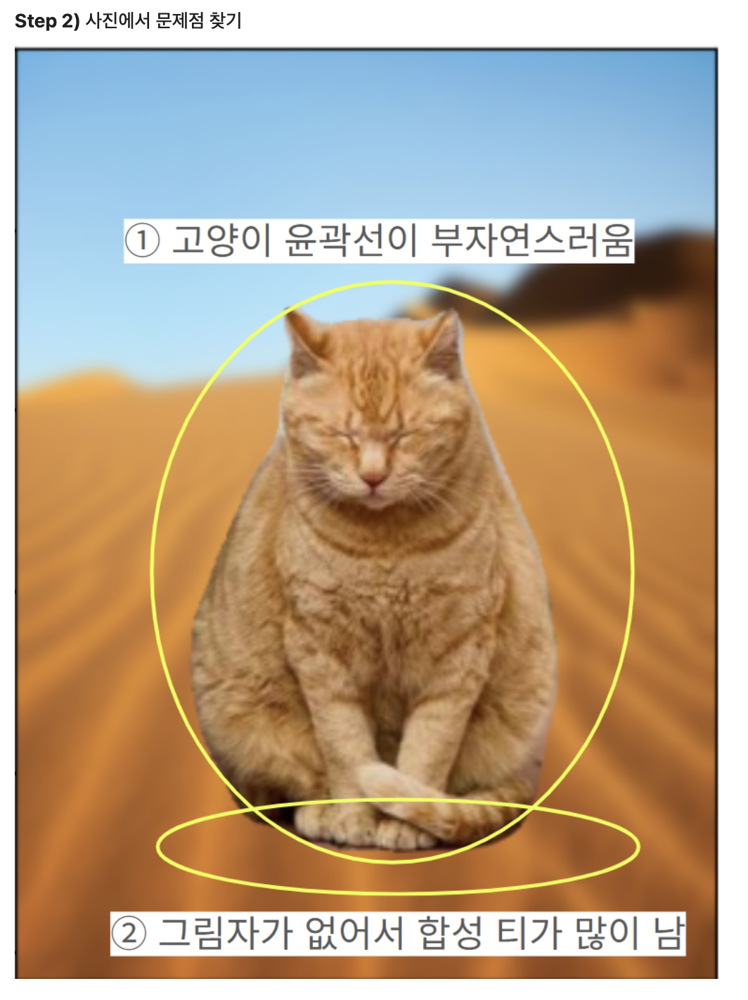
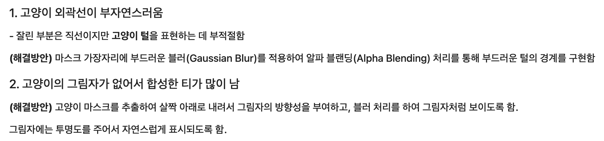
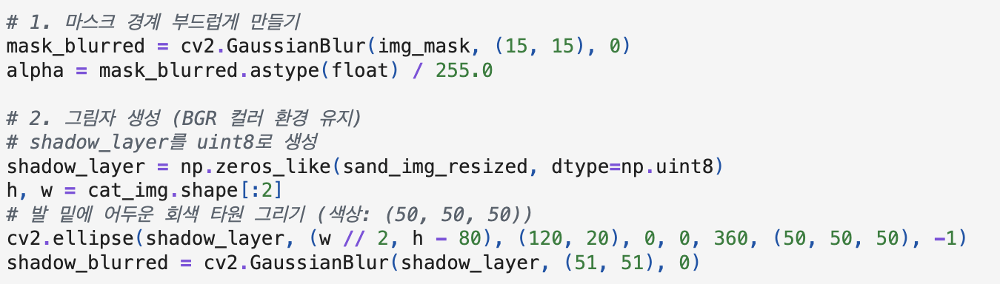
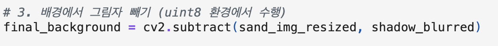
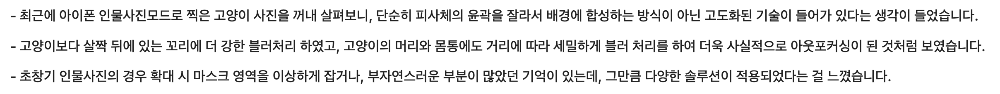
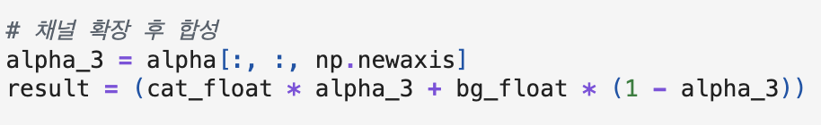

# AIFFEL Campus Online Code Peer Review Templete
- 코더 : 임성배
- 리뷰어 : 이다겸


# PRT(Peer Review Template)
- [x]  **1. 주어진 문제를 해결하는 완성된 코드가 제출되었나요?**



사막 배경에 고양이를 합성한 크로마키 사진과, 해당 배경에 Gaussian Blur를 적용하여 shallow focus 효과를 사진을 완성하였다. 




고양이 외곽선이 딱딱하게 잘리는 문제에 대한 솔루선을 제시하였고, 그림자가 없어 배경 대비 붕 뜨는 문제에 대해서도   
그 구체적인 이유와 함께 코드로 구현하였다. 또한 사진을 통해 문제점을 정확히 지적하였다. 

    
- [x]  **2. 전체 코드에서 가장 핵심적이거나 가장 복잡하고 이해하기 어려운 부분에 작성된 
주석 또는 doc string을 보고 해당 코드가 잘 이해되었나요?**

  

단순히 마스크대로 잘라 붙이는 것을 넘어, 자연스러운 합성을 위해 알파블랜딩과 그림자 레이어 감산을 유기적으로 규현하였다.   
또한 단계별로 넘버링을 하여 주석이 매우 체계적으로 달려있어 연산의 흐름을 쉽게 이해할 수 있다. 
        
- [x]  **3. 에러가 난 부분을 디버깅하여 문제를 해결한 기록을 남겼거나
새로운 시도 또는 추가 실험을 수행해봤나요?**

  

일반적인 배경 흐림 처리에 그치지 않고, 가상으로 고양이 발밑에 맞는 차원(cv2.ellipse)을 생성하고,   
이를 Gaussian Blur로 뭉갠 다음 뒤 배경에서 감산(cv2.subtract)하는 방식을 기도하였다. 이는 빛의 방향과 접지면을 고려한  
훌륭한 추가 실험이다.   
- [x]  **4. 회고를 잘 작성했나요?**

  

아이폰의 인물사진모드가 보여주는 아웃포커싱 기술이 단순히 피사체 윤곽만 따는 것이 아니라, 피사체 내부의 심도까지 고려한다는 점을   
파악하여, 앞으로 더 고도화된 솔류션이 필요하다는 깊이 있는 인사이트를 회고에 남겼다. 
        
- [x]  **5. 코드가 간결하고 효율적인가요?**
  
  
연산 과정에서 numpy 배열의 브로드캐스팅(np.newaxis)을 활용하여 반복문 없이 간결하게 알파 블렌딩을 수행하였다. 


# 회고(참고 링크 및 코드 개선)
```
성배님이 작성하신 코드는 CV 실습의 목적을 아주 정확하게 관통하고 있습니다! 
특히 단순히 함수만 받아 쓰는 게 아니라, 깃허브 코드의 In [20]에서처럼 cv2.ellipse와 cv2.subtract를 
조합하여 자연스러운 그림자 레이어를 직접 구축하신 아이디어가 매우 기발하고 훌륭했습니다. 

마스크 경계면을 알파 블렌딩 처리할 때 3채널 확장을 위해 np.newaxis를 활용하여 
코드를 단 몇 줄로 깔끔하고 효율적으로 짜신 부분도 인상 깊었습니다. 

회고에서 언급해주신 '피사체 내부의 거리에 따른 단계별 블러 처리(심도 맵 적용)' 아이디어는 
나중에 Depth Estimation 모델(예: MiDaS 등)과 연동해 발전시켜 보면 훨씬 멋진 프로젝트가 될 것 같습니다. 
수고 많으셨습니다!
```
[참고 링크]  
Depth Estimation 모델 관련 내용 : https://www.ultralytics.com/ko/blog/what-is-monocular-depth-estimation-an-overview#%EB%8B%A8%EC%95%88-%EA%B9%8A%EC%9D%B4-%EC%B6%94%EC%A0%95%EC%97%90-%EB%8C%80%ED%95%9C-%EA%B0%84%EB%9E%B5%ED%95%9C-%EC%86%8C%EA%B0%9C  
MiDas 관련 파이토치 : https://pytorch.kr/hub/intelisl-midas-v2/  
