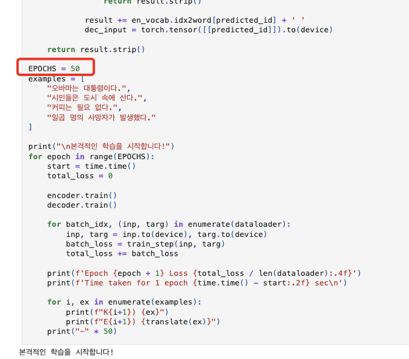
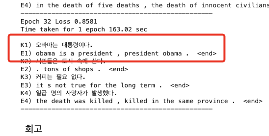
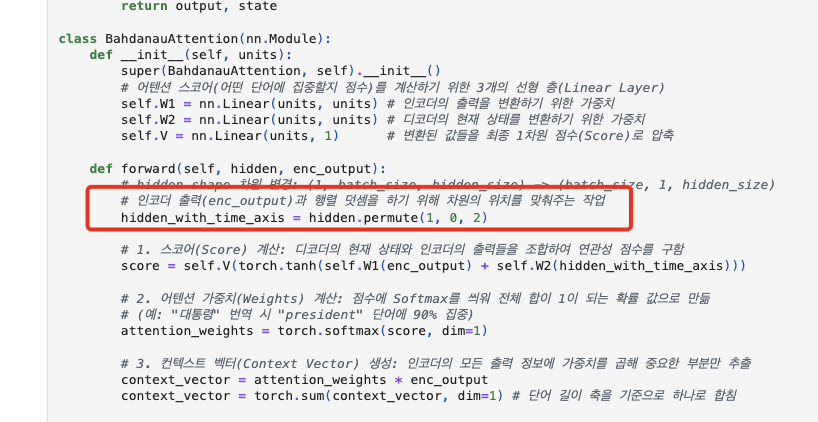
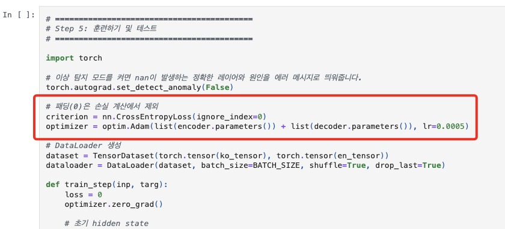
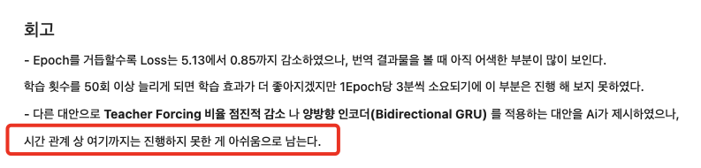
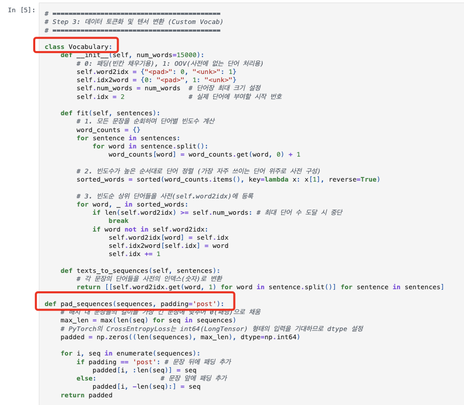

# AIFFEL Campus Online Code Peer Review Templete
- 코더 : 임성배 님
- 리뷰어 : 김민욱


# PRT(Peer Review Template)
- [x]  **1. 주어진 문제를 해결하는 완성된 코드가 제출되었나요?**
    - baseline 없이 PyTorch로 Bahdanau Attention 기반 seq2seq 한국어->영어 번역기를 처음부터 끝까지 완성하셨네요.  
    - 데이터 로드/정제 -> 토큰화(직접 만든 Vocabulary) -> 모델 설계(Encoder/Attention/Decoder) -> 학습 -> 번역 테스트까지 단계(Step 1~5)가 끊김 없이 다 이어져 있어서 흐름을 따라가기 좋았습니다.  
    - 50 epoch 학습 결과 Loss가 5.13에서 0.85까지 떨어졌고, epoch마다 예시 4문장을 직접 번역해 출력까지 남겨두셔서 결과물이 확실하게 보였어요. 그리고 50까지 돌리셔서 loss값을 0.대까지 낮춘게 인상적이었습니다.  
      
    - "오바마는 대통령이다 -> obama is a president , president obama" 처럼 학습이 진행될수록 번역이 자리잡아 가는 게 출력으로 그대로 보여서 좋았습니다. (마지막 학습 셀 출력)  
      

- [x]  **2. 전체 코드에서 가장 핵심적이거나 가장 복잡하고 이해하기 어려운 부분에 작성된 주석 또는 doc string을 보고 해당 코드가 잘 이해되었나요?**
    - 제일 핵심이자 어려운 부분은 Decoder가 어텐션 컨텍스트 벡터와 임베딩된 단어를 합쳐서 GRU에 넣는 곳이라고 봤어요.  
    - 특히 `self.gru = nn.GRU(embedding_dim + dec_units, ...)` 위에 "★핵심: 방금 예측한 단어와 어텐션으로 가져온 컨텍스트 벡터를 '함께' 입력받기 때문"이라고 적어주신 주석 덕분에, 왜 입력 차원이 둘을 더한 값인지 한 번에 이해됐습니다.  
    - BahdanauAttention에서 score -> softmax -> context vector로 이어지는 세 단계마다 "어떤 단어에 집중할지 점수", "전체 합이 1이 되는 확률", "중요한 부분만 추출" 이라고 풀어써주셔서, 어텐션이 처음인 제가 봐도 따라갈 수 있었어요.  
    - `hidden.permute(1, 0, 2)` 처럼 헷갈리는 차원 바꾸기도 "행렬 덧셈을 하기 위해 차원 위치를 맞춰주는 작업"이라고 이유를 적어주신 게 좋았습니다.  
      

    ```python
    # ★핵심: 입력 차원이 (embedding_dim + dec_units) 입니다.
    # 방금 예측한 단어와 어텐션으로 가져온 컨텍스트 벡터를 '함께' 입력받기 때문입니다.
    self.gru = nn.GRU(embedding_dim + dec_units, dec_units, batch_first=True)
    ...
    # 3. 컨텍스트 벡터와 임베딩된 단어를 하나로 이어붙임(Concatenate)
    x = torch.cat((context_vector.unsqueeze(1), x), dim=-1)
    ```

- [x]  **3. 에러가 난 부분을 디버깅하여 문제를 해결한 기록을 남겼거나 새로운 시도 또는 추가 실험을 수행해봤나요?**
    - 학습 안정화를 위해 신경 쓰신 흔적이 여러 군데 보였어요. `torch.autograd.set_detect_anomaly`로 nan 추적 모드를 켤 수 있게 해두신 것, `clip_grad_norm_`으로 그래디언트 폭주를 막으신 것이 그렇습니다.  
    - Loss 계산에서 `CrossEntropyLoss(ignore_index=0)`로 패딩을 빼고, train_step 안에서도  
      `if (targ[:, t] != 0).sum() > 0` 으로 타겟이 전부 패딩인 타임스텝은 누적에서 거른 게 꼼꼼했어요.  
        
    - 회고에 "Teacher Forcing 비율 점진적 감소나 양방향 인코더(Bidirectional GRU)" 같은 다음 시도 후보를 적어두신 것도 좋았습니다. 다음에 시도해보신 결과를 기대하겠습니다!  

- [x]  **4. 회고를 잘 작성했나요?**
    - 맨 끝에 "Loss는 5.13에서 0.85까지 떨어졌지만 번역 결과는 아직 어색하다, 50회 이상은 1 epoch당 3분이라 시간상 못 했다"고 솔직하게 적어주셔서 좋았습니다. 결과를 과장하지 않고 한계를 그대로 쓰신 점이 와닿았어요.    
      

- [x]  **5. 코드가 간결하고 효율적인가요?**
    - 변수명이 직관적이고(`enc_output`, `dec_hidden`, `context_vector`) Encoder/BahdanauAttention/Decoder를 각각 클래스로 나눠두셔서 구조가 깔끔했습니다.  
    - 토크나이저를 keras 같은 라이브러리에 의존하지 않고 `Vocabulary` 클래스와 `pad_sequences` 함수로  
      직접 구현하신 게 인상적이었어요.  
      빈도순 정렬 -> 상위 NUM_WORDS만 사전 등록, OOV는 `<unk>`(1)로 처리하는 로직이 한 클래스 안에 잘 모여 있었습니다.  
         


# 회고(참고 링크 및 코드 개선)
```
[리뷰어 회고]
나도 같은 노드를 하면서 어텐션의 context vector를 디코더 입력에 어떻게 붙이는지가 헷갈렸는데,  
임성배님이 GRU 입력 차원에 "★핵심" 주석으로 (임베딩+컨텍스트)라고
콕 짚어두신 덕분에 복습이 되어서 좋았습니다.  
Vocabulary와 pad_sequences를 라이브러리 없이 직접 짜신 것도  
"토크나이저가 결국 빈도순 사전일 뿐이구나" 하고 배워가는 포인트였습니다.  
50 epoch을 끝까지 돌리고 epoch마다 번역 변화를 남겨두신 끈기도 좋았습니다.  
고생 많으셨어요!

[가볍게 같이 생각해볼 점]
- 정량 평가(BLEU 점수)가 있으면 "얼마나 좋아졌나"를 숫자로도 보여줄 수 있을 것 같아요.
  지금은 epoch별 번역문(정성 평가)만 있어서, BLEU를 한 번 찍어보면 회고의
  "아직 어색하다"가 점수로도 뒷받침될 것 같습니다.  
  (저도 이번 노드에서 BLEU를 써봤는데 번역기엔 잘 맞는 지표 같았어요.)
```
