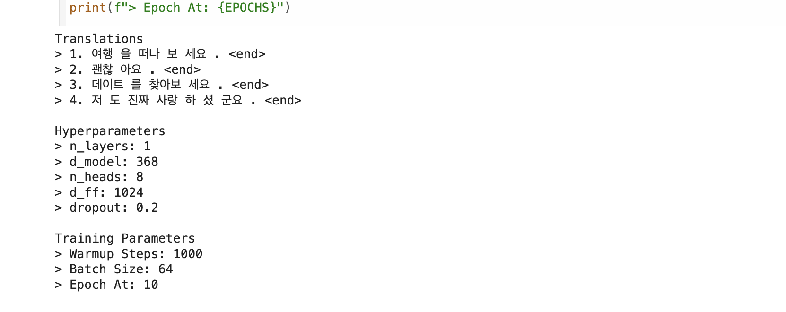
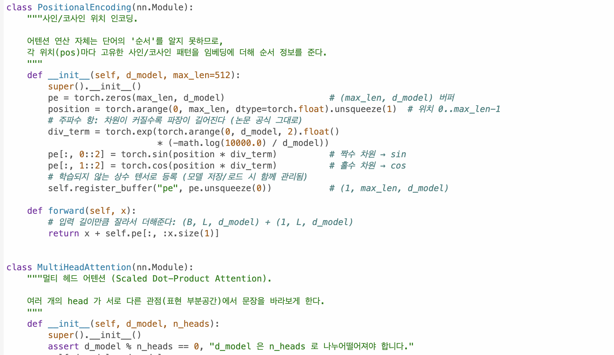
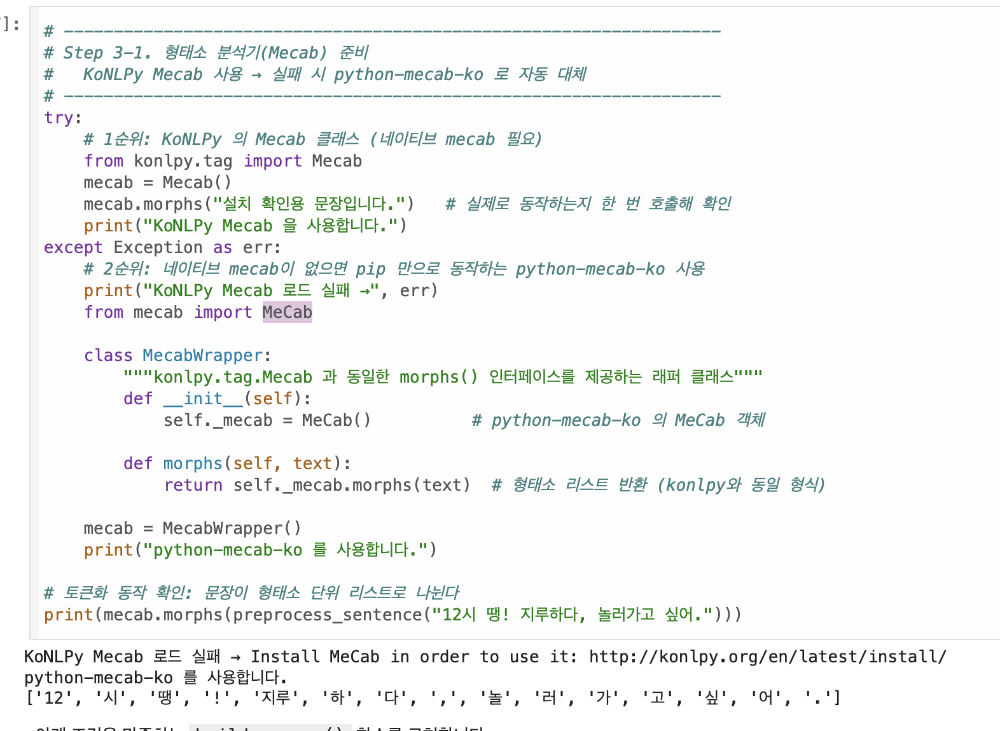
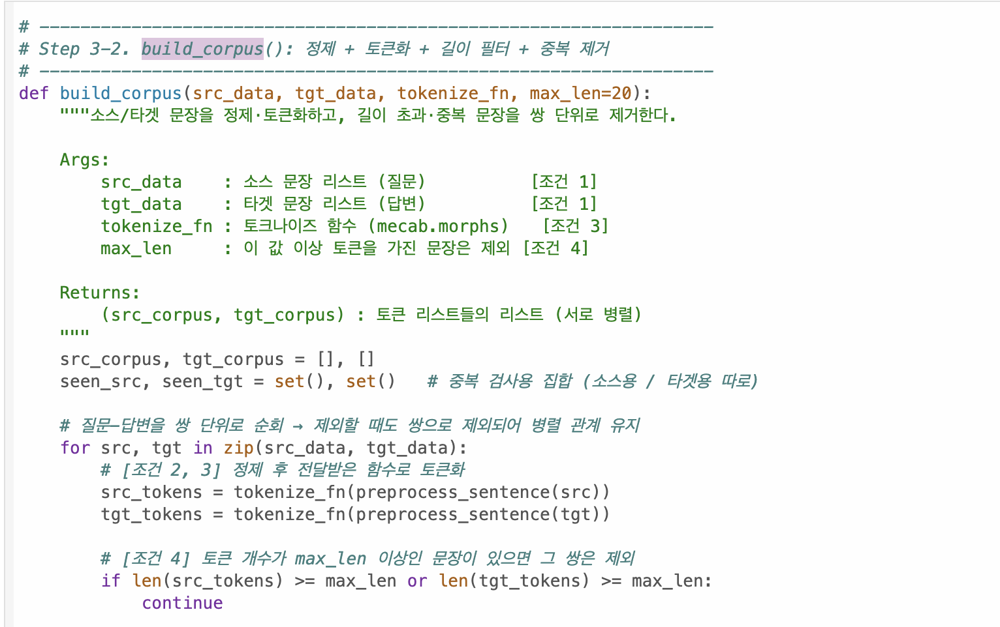

# AIFFEL Campus Online Code Peer Review Templete
- 코더 : 임성배
- 리뷰어 : 강경수

# PRT(Peer Review Template)
- [x]  **1. 주어진 문제를 해결하는 완성된 코드가 제출되었나요?**
    
  > 예문 4개 답변, 하이퍼파라미터, 훈련 파라미터까지 지시된 제출 양식대로 빠짐없이 출력됨.
    
- [x]  **2. 전체 코드에서 가장 핵심적이거나 가장 복잡하고 이해하기 어려운 부분에 작성된 
주석 또는 doc string을 보고 해당 코드가 잘 이해되었나요?**
    
  > Transformer, MultiHeadAttention 클래스에 "왜 이렇게 하는지"까지 설명하는 docstring이 특히 잘 되어있음.
        
- [x]  **3. 에러가 난 부분을 디버깅하여 문제를 해결한 기록을 남겼거나
새로운 시도 또는 추가 실험을 수행해봤나요?**
     
  > Mecab/Word2Vec 로드 실패 시 대체 로직(try-except + fallback)은 잘 문서화돼 있음.
        
- [x]  **4. 회고를 잘 작성했나요?**
    
  > 회고가 작성됨.
        
- [x]  **5. 코드가 간결하고 효율적인가요?**
    
  > 함수 단위 분리 잘 되어 있고(build_corpus, vectorize, generate 등), 네이밍이나 구조도 PEP8에 크게 벗어나지 않음.

# 회고(참고 링크 및 코드 개선)
> Transformer 구조와 마스크 설계까지 꼼꼼하게 주석으로 설명해주셔서 코드 이해하는 데 큰 도움이 됐습니다, 고생하셨습니다!
