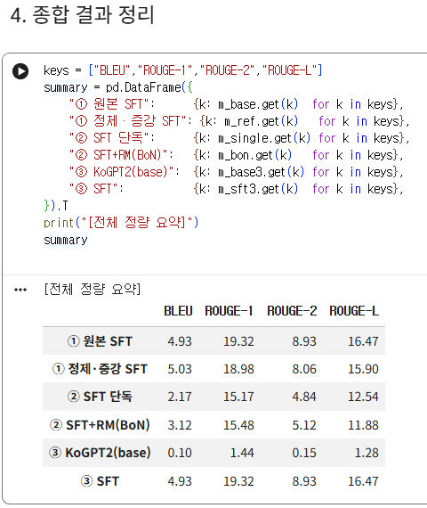
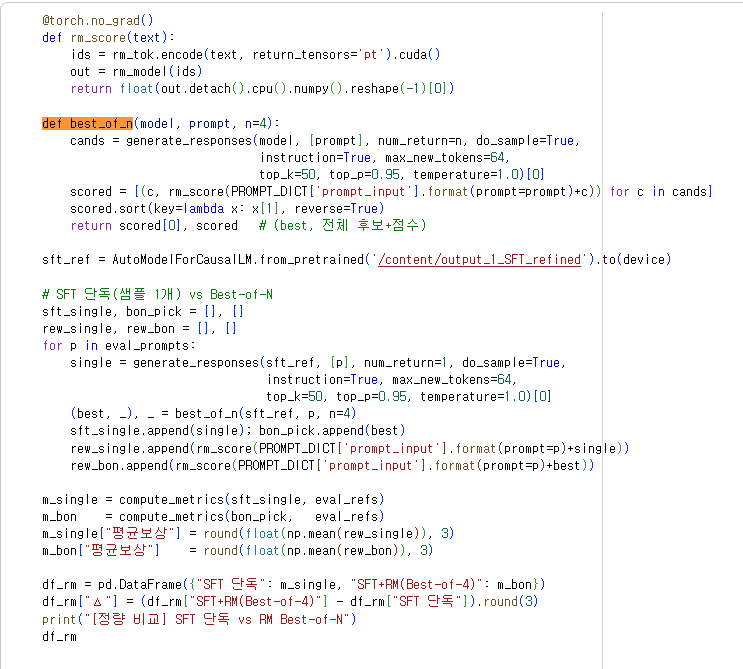
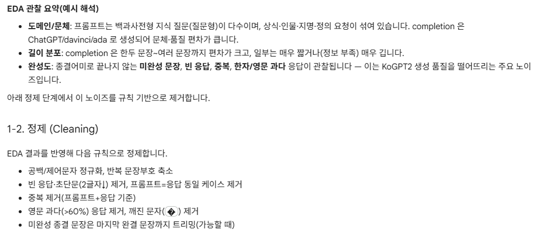
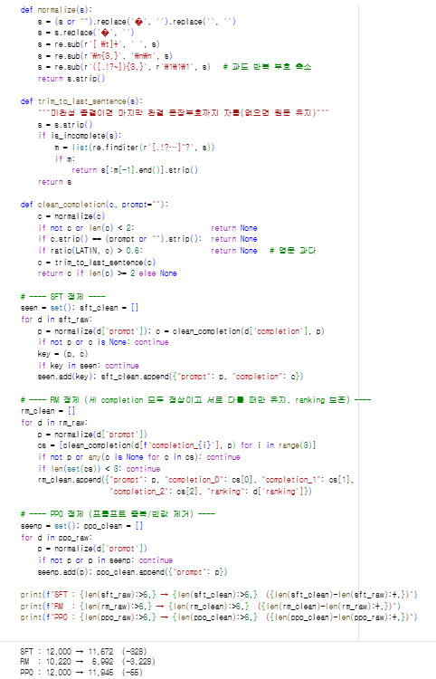
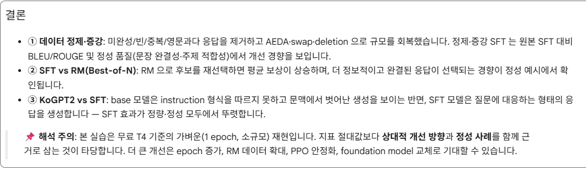
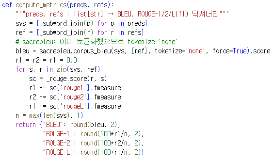
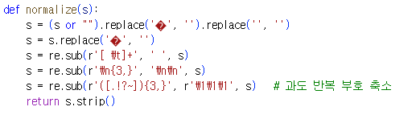

# AIFFEL Campus Online Code Peer Review Templete
- 코더 : 임성배
- 리뷰어 : 서한호


# PRT(Peer Review Template)
- [x]  **1. 주어진 문제를 해결하는 완성된 코드가 제출되었나요?**
    - 문제에서 요구하는 최종 결과물이 첨부되었는지 확인
        - 중요! 해당 조건을 만족하는 부분을 캡쳐해 근거로 첨부  
  
## 모두 실행되어 최종 생성 결과까지 나왔고, 전부 에러 없이 완료되었습니다.  

    
- [x]  **2. 전체 코드에서 가장 핵심적이거나 가장 복잡하고 이해하기 어려운 부분에 작성된 
주석 또는 doc string을 보고 해당 코드가 잘 이해되었나요?**
    - 해당 코드 블럭을 왜 핵심적이라고 생각하는지 확인
    - 해당 코드 블럭에 doc string/annotation이 달려 있는지 확인
    - 해당 코드의 기능, 존재 이유, 작동 원리 등을 기술했는지 확인
    - 주석을 보고 코드 이해가 잘 되었는지 확인
        - 중요! 잘 작성되었다고 생각되는 부분을 캡쳐해 근거로 첨부

## 가장 복잡한 def best_of_n(RM으로 SFT 후보 N개를 재선택하는 Best-of-N 리랭킹) 블록이 왜, 어떻게 동작하는지 주석과 흐름이 명확했습니다.  

        
- [x]  **3. 에러가 난 부분을 디버깅하여 문제를 해결한 기록을 남겼거나
새로운 시도 또는 추가 실험을 수행해봤나요?**
    - 문제 원인 및 해결 과정을 잘 기록하였는지 확인
    - 프로젝트 평가 기준에 더해 추가적으로 수행한 나만의 시도, 
    실험이 기록되어 있는지 확인
        - 중요! 잘 작성되었다고 생각되는 부분을 캡쳐해 근거로 첨부

  
## 프로젝트: KoChatGPT 업그레이드 이후 EDA → 규칙기반 정제(def normalize) → AEDA·swap·deletion 증강 → SFT 재학습 → BLEU·ROUGE 정량 + 정성 비교까지 평가 기준을 넘어선 자발적 실험이 풍부합니다. 한글 깨짐 방지 등 콜랩 환경 이슈를 직접 수정한 기록도 확인했습니다.  

        
- [x]  **4. 회고를 잘 작성했나요?**
    - 주어진 문제를 해결하는 완성된 코드 내지 프로젝트 결과물에 대해
    배운점과 아쉬운점, 느낀점 등이 기록되어 있는지 확인
    - 전체 코드 실행 플로우를 그래프로 그려서 이해를 돕고 있는지 확인
        - 중요! 잘 작성되었다고 생각되는 부분을 캡쳐해 근거로 첨부

## 결과 요약과 "1 epoch·소규모 재현이라 절대값보다 상대 개선을 봐야 한다"는 해석 주의까지 잘 정리되어 있습니다.  

        
- [x]  **5. 코드가 간결하고 효율적인가요?**
    - 파이썬 스타일 가이드 (PEP8) 를 준수하였는지 확인
    - 코드 중복을 최소화하고 범용적으로 사용할 수 있도록 함수화/모듈화했는지 확인
        - 중요! 잘 작성되었다고 생각되는 부분을 캡쳐해 근거로 첨부


## compute_metrics, normalize등 반복 로직을 함수로 잘 모듈화해 재사용성이 좋았습니다.  


# 회고(참고 링크 및 코드 개선)
```
데이터 정제·증강부터 RM Best-of-N 리랭킹, base vs SFT 정량/정성 비교까지 RLHF 파이프라인을 폭넓게 다룬 점이 인상적이었고, 특히 지표 절대값에 매몰되지 않고 상대적 개선과 정성 사례를 함께 근거로 삼은 해석 태도가 좋았습니다.  

```
