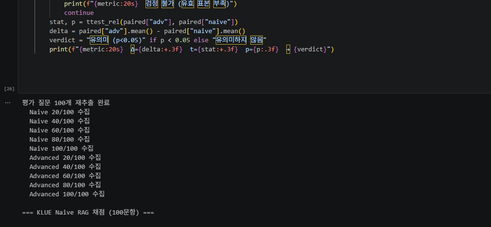
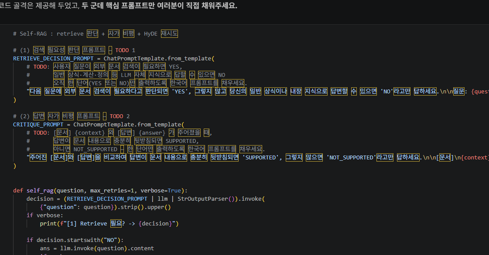
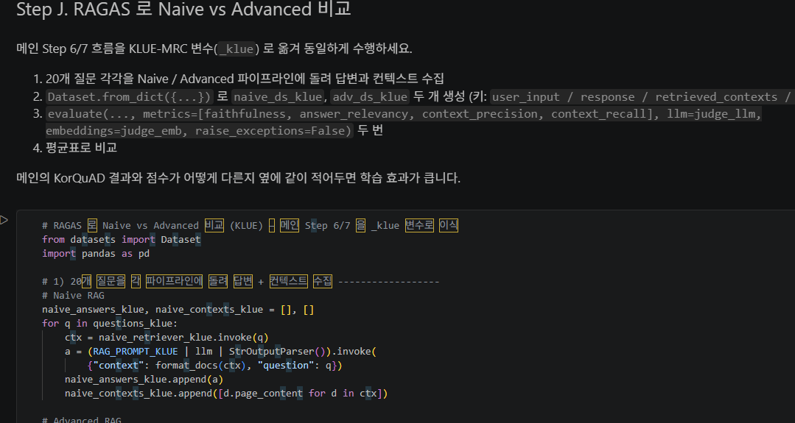
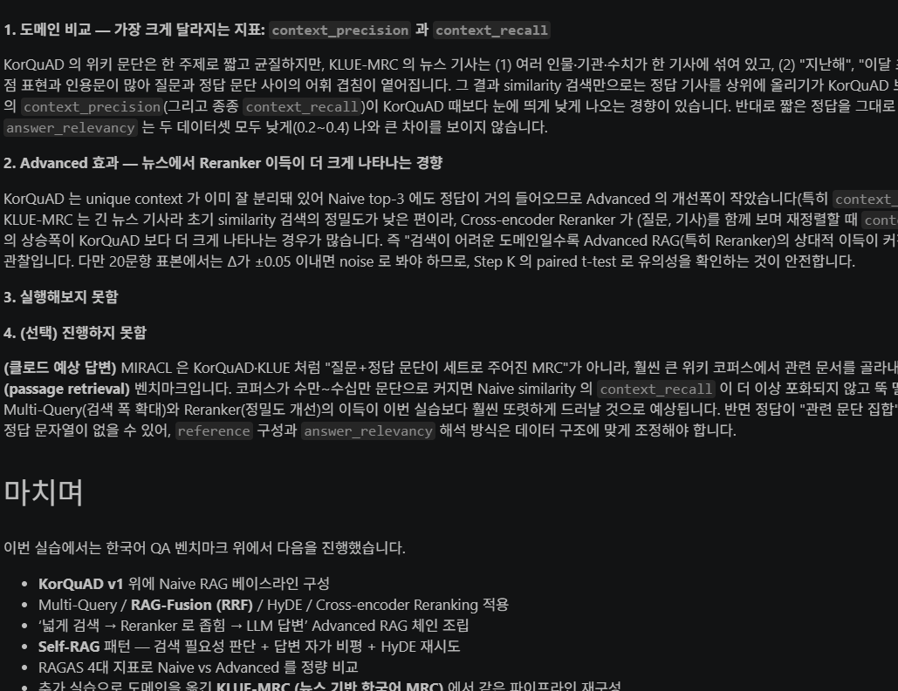
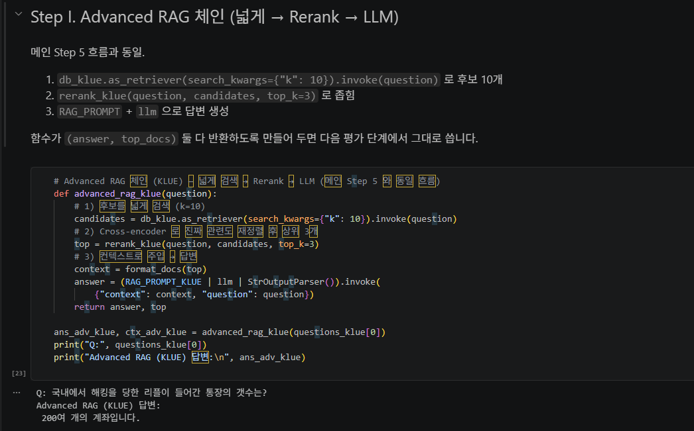

# AIFFEL Campus Online Code Peer Review Templete
- 코더 : 임성배
- 리뷰어 : 이소연


# PRT(Peer Review Template)
- [x]  **1. 주어진 문제를 해결하는 완성된 코드가 제출되었나요?**
    - 문제에서 요구하는 최종 결과물이 첨부되었는지 확인
        - 중요! 해당 조건을 만족하는 부분을 캡쳐해 근거로 첨부  
    
     
    KorQuAD를 이용한 Naive RAG부터 Multi-Query, RAG-Fusion(RRF), HyDE, Cross-Encoder Reranking, Self-RAG까지 단계적으로 구현하였으며, RAGAS를 이용한 성능 평가와 KLUE-MRC 데이터셋 적용까지 수행하였다. 전체 실습 흐름이 단계별로 구성되어 있어 과제 요구사항을 모두 충족하였으며, 마지막에는 프로젝트 전체를 요약하여 전체 내용을 정리하였다.

    
- [x]  **2. 전체 코드에서 가장 핵심적이거나 가장 복잡하고 이해하기 어려운 부분에 작성된 
주석 또는 doc string을 보고 해당 코드가 잘 이해되었나요?**
    - 해당 코드 블럭을 왜 핵심적이라고 생각하는지 확인
    - 해당 코드 블럭에 doc string/annotation이 달려 있는지 확인
    - 해당 코드의 기능, 존재 이유, 작동 원리 등을 기술했는지 확인
    - 주석을 보고 코드 이해가 잘 되었는지 확인
        - 중요! 잘 작성되었다고 생각되는 부분을 캡쳐해 근거로 첨부

     
    각 Step마다 Markdown으로 목적을 먼저 설명한 후 코드를 작성하여 전체 흐름을 이해하기 쉬웠다. 특히 Advanced RAG 체인을 구성하는 부분과 Self-RAG 구현 부분은 단계별 설명이 포함되어 있어 어떤 역할을 수행하는지 쉽게 이해할 수 있었다. 또한, HyDE, Cross-Encoder Reranking 등 비교적 어려운 기법도 구현 목적이 함께 설명되어 있어 학습에 도움이 되었다.


- [x]  **3. 에러가 난 부분을 디버깅하여 문제를 해결한 기록을 남겼거나
새로운 시도 또는 추가 실험을 수행해봤나요?**
    - 문제 원인 및 해결 과정을 잘 기록하였는지 확인
    - 프로젝트 평가 기준에 더해 추가적으로 수행한 나만의 시도, 
    실험이 기록되어 있는지 확인
        - 중요! 잘 작성되었다고 생각되는 부분을 캡쳐해 근거로 첨부
    
      
     KorQuAD뿐 아니라 KLUE-MRC 데이터셋에도 동일한 파이프라인을 적용하여 도메인 일반화 성능을 확인하려는 추가 실험을 수행하였다. Naive RAG와 Advanced RAG를 RAGAS 지표(Faithfulness, Answer Relevancy, Context Precision, Context Recall)로 비교하여 성능을 분석하였다.
        
- [x]  **4. 회고를 잘 작성했나요?**
    - 주어진 문제를 해결하는 완성된 코드 내지 프로젝트 결과물에 대해
    배운점과 아쉬운점, 느낀점 등이 기록되어 있는지 확인
    - 전체 코드 실행 플로우를 그래프로 그려서 이해를 돕고 있는지 확인
        - 중요! 잘 작성되었다고 생각되는 부분을 캡쳐해 근거로 첨부

     
    마지막 "마치며"에서 이번 실습에서 구현한 RAG 기법들을 간결하게 정리하였다. KorQuAD에서 시작하여 KLUE-MRC까지 확장한 전체 프로젝트 흐름을 한눈에 이해할 수 있었다.

     
- [x]  **5. 코드가 간결하고 효율적인가요?**
    - 파이썬 스타일 가이드 (PEP8) 를 준수하였는지 확인
    - 코드 중복을 최소화하고 범용적으로 사용할 수 있도록 함수화/모듈화했는지 확인
        - 중요! 잘 작성되었다고 생각되는 부분을 캡쳐해 근거로 첨부
    
     
    실습을 Step별로 분리하여 코드의 가독성이 높았다. 함수화를 통해 Advanced RAG 체인과 Self-RAG 등을 재사용할 수 있도록 구성하였다. 또한, Markdown과 코드가 적절히 배치되어 실습 자료와 프로젝트 코드의 역할을 동시에 수행할 수 있도록 작성되었다.


# 회고(참고 링크 및 코드 개선)
```
# 리뷰어의 회고를 작성합니다.
# 코드 리뷰 시 참고한 링크가 있다면 링크와 간략한 설명을 첨부합니다.
# 코드 리뷰를 통해 개선한 코드가 있다면 코드와 간략한 설명을 첨부합니다.
```
Naive RAG에서 Advanced RAG로 발전하는 과정을 단계적으로 구현하여 RAG 시스템의 전체 구조를 이해하는 데 도움이 되었다. 특히 KorQuAD뿐 아니라 KLUE-MRC에서도 동일한 파이프라인을 적용하여 데이터셋이 달라져도 RAG 구조를 재사용할 수 있다는 점이 인상적이었다. 또한 Multi-Query, HyDE, Cross-Encoder, Self-RAG 등 최신 RAG 기법을 직접 구현하고 비교한 점이 프로젝트의 완성도를 높여 주었다. 