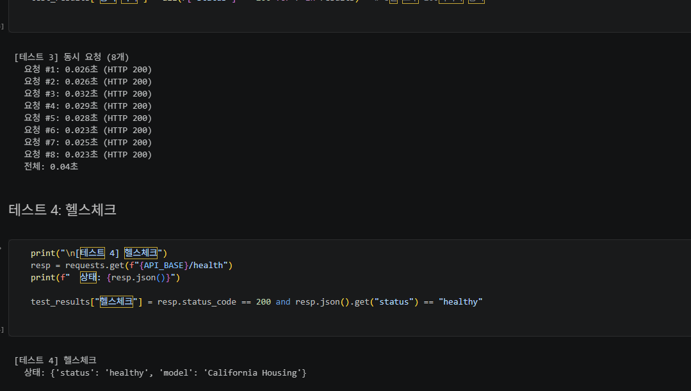
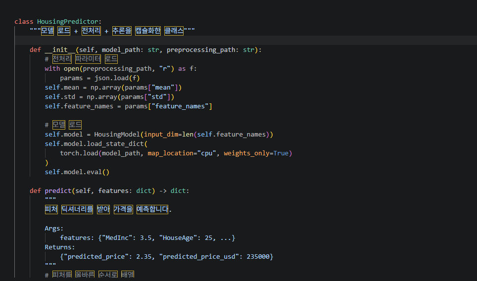
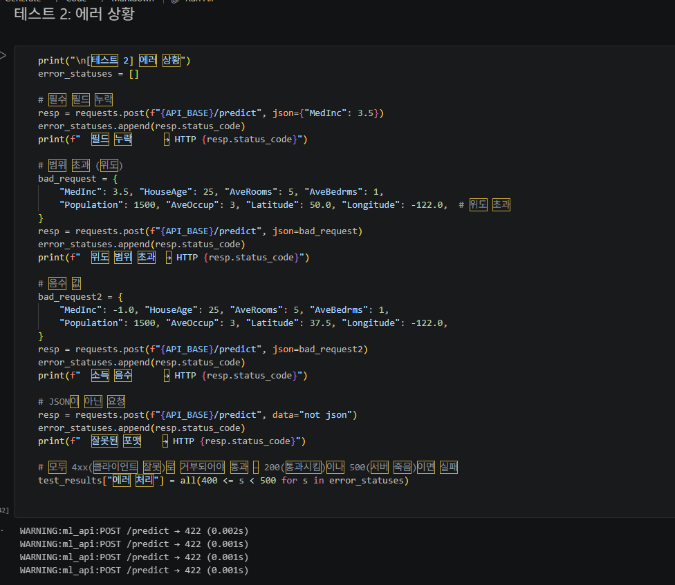
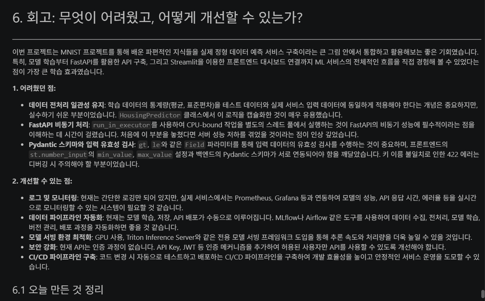
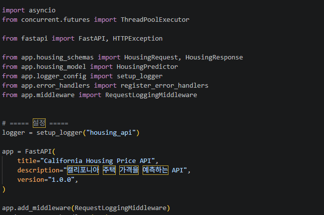

# AIFFEL Campus Online Code Peer Review Templete
- 코더 : 임성배
- 리뷰어 : 이소연


# PRT(Peer Review Template)
- [x]  **1. 주어진 문제를 해결하는 완성된 코드가 제출되었나요?**
    - 문제에서 요구하는 최종 결과물이 첨부되었는지 확인
        - 중요! 해당 조건을 만족하는 부분을 캡쳐해 근거로 첨부
    
    
    모델 학습부터 FastAPI를 이용한 API 구현, Streamlit 대시보드 연결까지 전체 과정이 완성되어 있습니다. 정상 요청뿐만 아니라 에러 상황, 동시 요청, 헬스체크까지 테스트하였습니다. 최종적으로 4가지 통합 테스트가 모두 통과되어 전체 서비스가 정상적으로 동작하는 것을 확인할 수 있었습니다.

- [x]  **2. 전체 코드에서 가장 핵심적이거나 가장 복잡하고 이해하기 어려운 부분에 작성된 
주석 또는 doc string을 보고 해당 코드가 잘 이해되었나요?**
    - 해당 코드 블럭을 왜 핵심적이라고 생각하는지 확인
    - 해당 코드 블럭에 doc string/annotation이 달려 있는지 확인
    - 해당 코드의 기능, 존재 이유, 작동 원리 등을 기술했는지 확인
    - 주석을 보고 코드 이해가 잘 되었는지 확인
        - 중요! 잘 작성되었다고 생각되는 부분을 캡쳐해 근거로 첨부

    
    모델의 전처리와 추론 과정이 기능별로 구성되어 있어 전체 흐름을 이해하기 쉬웠습니다. 특히 학습 데이터의 평균과 표준편차를 저장하고 추론 시 동일하게 적용하는 이유가 잘 설명되어 있었습니다. FastAPI에서 비동기 처리를 적용한 부분도 코드의 역할을 이해하는 데 도움이 되었습니다.

- [x]  **3. 에러가 난 부분을 디버깅하여 문제를 해결한 기록을 남겼거나
새로운 시도 또는 추가 실험을 수행해봤나요?**
    - 문제 원인 및 해결 과정을 잘 기록하였는지 확인
    - 프로젝트 평가 기준에 더해 추가적으로 수행한 나만의 시도, 
    실험이 기록되어 있는지 확인
        - 중요! 잘 작성되었다고 생각되는 부분을 캡쳐해 근거로 첨부

    
    정상적인 입력뿐만 아니라 필드 누락, 범위 초과, 음수 입력, 잘못된 포맷 등의 에러 상황을 테스트하였습니다. 잘못된 입력이 HTTP 422로 처리되는 것을 확인하여 입력 검증이 정상적으로 작동함을 확인했습니다. 또한 8개의 동시 요청을 모두 성공적으로 처리하는 추가 테스트도 수행했습니다.

- [x]  **4. 회고를 잘 작성했나요?**
    - 주어진 문제를 해결하는 완성된 코드 내지 프로젝트 결과물에 대해
    배운점과 아쉬운점, 느낀점 등이 기록되어 있는지 확인
    - 전체 코드 실행 플로우를 그래프로 그려서 이해를 돕고 있는지 확인
        - 중요! 잘 작성되었다고 생각되는 부분을 캡쳐해 근거로 첨부

    
    모델 학습부터 API와 프론트엔드 연결까지 진행하면서 배운 점과 어려웠던 부분이 잘 정리되어 있습니다. 특히 데이터 전처리와 실제 배포 과정의 연결에 대해 구체적으로 회고한 점이 좋았습니다. 향후 개선할 부분도 함께 작성되어 있어 프로젝트를 전체적으로 돌아볼 수 있었습니다.

- [x]  **5. 코드가 간결하고 효율적인가요?**
    - 파이썬 스타일 가이드 (PEP8) 를 준수하였는지 확인
    - 코드 중복을 최소화하고 범용적으로 사용할 수 있도록 함수화/모듈화했는지 확인
        - 중요! 잘 작성되었다고 생각되는 부분을 캡쳐해 근거로 첨부

    
    모델, API, 데이터 검증, 프론트엔드 기능이 역할별로 나누어져 있어 코드 구조가 명확했습니다. 반복되는 기능을 함수와 클래스로 분리하여 전체 코드를 이해하기 쉽게 구성하였습니다. 모델 추론과 API 처리 부분도 기능별로 분리되어 있어 유지보수하기 좋은 구조라고 생각합니다.


# 회고(참고 링크 및 코드 개선)
```
# 리뷰어의 회고를 작성합니다.
# 코드 리뷰 시 참고한 링크가 있다면 링크와 간략한 설명을 첨부합니다.
# 코드 리뷰를 통해 개선한 코드가 있다면 코드와 간략한 설명을 첨부합니다.
```
전체적으로 모델 학습부터 API 구현, Streamlit 연동, 테스트까지 하나의 흐름으로 잘 구성되어 있어 프로젝트의 목적을 이해하기 쉬웠습니다. 특히 정상 요청뿐만 아니라 잘못된 입력과 동시 요청까지 확인한 점에서 실제 서비스 상황을 고려한 구성이 인상적이었습니다. 코드를 보면서 모델 배포에서는 예측 성능뿐 아니라 전처리 일관성, 입력 검증, 안정적인 요청 처리도 중요하다는 점을 알 수 있었습니다. 이후 모델 성능 비교나 자동화된 테스트까지 추가하면 더 완성도 높은 프로젝트가 될 것 같습니다. 수고하셨습니다!